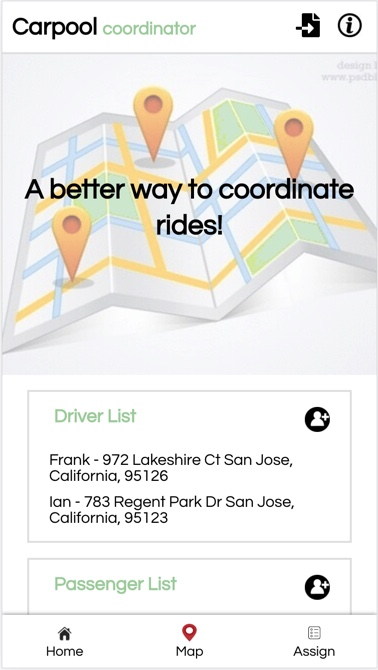
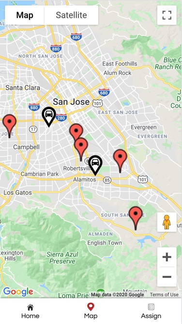

## Carpool Coordinator

This project uses the Google Map API to convert addresses to coordinates, and displays markers on an interactive map. 

The goal of this project is to help groups of people coordinate rides. On the interactive map, there are driver and passenger markers. A user can assign passenger markers to a driver based on location.

## Motivation

The motivation behind this project was started by my husband and his boy scout troop. With weekly activities, it was becoming a hassle to coordinate rides for boys who did not have a way to get to the activity. 

## Code style

-JSX 

## Screenshots




## Tech/framework used

This project was bootstrapped with [Create React App](https://github.com/facebook/create-react-app).

## Features

Assigning Driver - Clicking on a passenger marker will show an info window with an "unassigned" link. Clicking on the link will show the user a list of all the drivers. The user can click on the driver who they wish to assign to that passenger. 

Importing files - it may become annoying to enter names and addresses every time they enter the app. I am creating a file import button which takes in a google sheet with names and addresses. It will automatically fill in the list and map. 

Removing driver/passenger - After adding or importing a person a user can remove them by clicking the add person/edit button and then clicking then "x" button on the person they want to remove.

## Code Example 
Implementation of Google Map in React using react-google-maps

```
<GoogleMap defaultZoom={11}
            defaultCenter={props.driverList.length > 0 ? {lat: props.driverList[0].lat, lng: props.driverList[0].lng}: center}>
        
    {props.driverList.map((object, index)=> {
        if(props.driverList.length >0){
            return (
                <Marker position={{lat: object.lat, lng: object.lng}} key={index} 
                        onClick={()=>{setSelectDriver(object)}}
                        icon={{ url: "https://storage.needpix.com/rsynced_images/icon-2070748_1280.png",
                        scaledSize: new window.google.maps.Size(35, 50)}}/>           
            )
        }   
    })
    }
    {selectDriver && (
        <InfoWindow position={{lat: (selectDriver.lat), lng: selectDriver.lng}        onCloseClick= {()=> setSelectDriver(null)}>
            <div>
                <p><span>{selectDriver.name}</span><br/>{selectDriver.address}</p>
            </div>   
        </InfoWindow>
    )} 
```

## API Reference

Google Maps Geocoding API Reference

- https://developers.google.com/maps/documentation/geocoding/start?utm_source=google&utm_medium=cpc&utm_campaign=FY18-Q2-global-demandgen-paidsearchonnetworkhouseads-cs-maps_contactsal_saf&utm_content=text-ad-none-none-DEV_c-CRE_315916117595-ADGP_Hybrid+%7C+AW+SEM+%7C+BKWS+~+Google+Maps+Geocoding+API-KWID_43700040099688305-kwd-295562635667-userloc_9031970&utm_term=KW_google%20maps%20geocoding%20api-ST_google+maps+geocoding+api&gclid=CjwKCAjwvZv0BRA8EiwAD9T2VXHei3NtKw4S0m7iRy9KX52OLcJ5BLXD1ZyzsWrP9IBwz9XF9NtU1hoCzv4QAvD_BwE

Google Maps Javascript API
 - https://developers.google.com/maps/documentation/javascript/tutorial

## How to use?

To use this app, a user must have the names and addresses of the people they want to find on the map. On the home page they can enter the names and addresses of both drivers and passengers in the appropriate sections. They can then navigate to the map and interact with the driver and passenger markers. The Passenger markers will show the driver they are assigned to in their info window. At first, all the passenger markers will be unassigned. So the user can click on the unassigned hyperlink and then assign them to one of the drivers. When a marker is assigned, it turns blue and the user can navigate to the assigned list page to see all the assignments. 

## Contribute

Here are some following guidelines to contribute to Carpool Coordinator. 

### Write detailed information
Detailed information is very helpful to understand an issue.

For example:
* How to reproduce the issue, step-by-step.
* The expected behavior (or what is wrong).
* Screenshots for issues.
* The application version.
* The operating system.


### Pull Requests
Pull Requests are always welcome. 

1. When you edit the code, please run `npm run test` to check the formatting of your code before you `git commit`.
2. Ensure the PR description clearly describes the problem and solution.


## License

Carpool Coordinator © Alyssa Jackson


